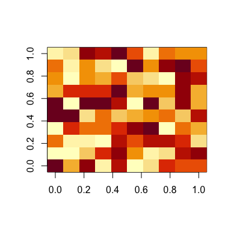

<p align="center">

</p>

## Overview

This repository contains the R scripts and a detailed walk-through for
generating the images used on the book cover and chapter pages of my PhD
dissertation (accessible
[here](https://hdl.handle.net/11370/38392092-dcac-4164-87d6-8918473e3503)):

> Feliciani, T. (2025). *Divided Spaces and Divided Opinions: Modeling
> the Impact of Residential Segregation on Opinion Polarization*. ICS
> dissertation series, Groningen.

The `./output/` directory contains the high-resolution versions of these
images, as well as the low-resolution versions used for this demo.

### Table of Contents

-   [Licensing](#licensing)
-   [Getting started](#getting-started)
-   [Book cover](#book-cover)
-   [Chapter 1](#chapter-1)
-   [Chapter 2](#chapter-2)
-   [Chapter 3](#chapter-3)
-   [Chapter 4](#chapter-4)
-   [Chapter 5](#chapter-5)

### Licensing

The dissertation is copyrighted, and this repository uses dual licensing
for different parts of the project:

-   **Software (r, Rmd, and md files in the root folder)**: Licensed
    under the [GNU General Public License v3.0
    (GPL-3.0)](https://www.gnu.org/licenses/gpl-3.0.html). See the
    [LICENSE](./LICENSE) file in the repository root for details.
-   **Images (contents of the `./output/` folder)**: Licensed under the
    [Creative Commons Attribution-NonCommercial-ShareAlike 4.0 (CC
    BY-NC-SA 4.0)](https://creativecommons.org/licenses/by-nc-sa/4.0/).
    See the [LICENSE](./output/LICENSE) file in the `./output/`
    directory.

## Getting started

This script runs in R, versions 4.3.1 to 4.4.1. It relies on a number of
external libraries and on utility functions defined in the separate
script “util.r”. Here is how I load these resources.

``` r
library("compiler")
library("reshape2")
library("dplyr")
library("ggplot2")
library("knitr")
library("lhs")
library("ambient")
library("plotly")
library("igraph")
library("ggfx")
library("ggnewscale")
library("rayshader")
library("rgl")

source("util.r") # Script with utility functions
```

## Book cover

The pictures I used for the front cover, back cover and invitation
bookmark are different views of a 3D scene that evokes a stylized city.
The way I generated the city is trivially simple. The “city” is nothing
more than a heatmap rendered in *ggplot2* and *rayshader*, and its
buildings are regions of the heatmap where values are higher than zero
(values are used to determine height). The “blocks” into which the city
is divided are obtained by “faceting” the heatmap using *facet_grid()*.

Before replicating the book cover images, here is a simplified example
to illustrate how it all works. I start with creating a dataframe with
rows representing buildings. Buildings have four coordinates: their x
and y position (i.e. longitude and latitude), and the x and y position
of the block they are in. For example:

``` r
# Creating the dataframe
d <- data.frame(
  x = sample(1:5, size = 100, replace = TRUE),
  y = sample(1:5, size = 100, replace = TRUE),
  xb = sample(1:4, size = 100, replace = TRUE),
  yb = sample(1:4, size = 100, replace = TRUE)
)

# Removing any rows/buildings that might be redundant (have same coords)
d <- unique(d)
```

And this is how this looks in ggplot, without any fancy 3D rendering:

``` r
ggplot(data = d, aes(x = x, y = y)) +
  geom_point() + # adding buildings
  facet_grid(xb ~ yb) # faceting to create "blocks"
```


The scene on the book cover is only slightly more complex than this
example. Specifically, building density (here, uniform) is higher in the
city center than the periphery. And buildings have two attributes, their
color and their height. Color can be white or orange, and I distribute
it across “blocks” in a way that gives a sense of residential
segregation. Height, used for 3D rendering, is distributed in such a way
that buildings in the city center tend to be taller than in the
periphery.

This is how it’s done in practice. First of all, I start with creating
three 6-by-6 matrices that I call *mGroup*, *mPol* and *mDens*. In each
matrix, cells represent blocks, and their value captures one of the
three characteristics of blocks:

-   Their color group (mGroup), that can be either 0 or 1 (white or
    orange buildings).

-   Their degree of polarization (mPol), i.e. how close the block is to
    a block with a different color group. I will use this attribute to
    paint the “pavement” in darker shades of gray where the two colors
    meet.

-   Their density (mDens), again higher in the city center, which I will
    use to determine building density and building height.

These attributes are all hard-coded.

``` r
mGroup <- matrix(0, nrow = 6, ncol = 6)
mGroup[1, 2:6] <- 1
mGroup[2, 3:6] <- 1
mGroup[3, 3:6] <- 1
mGroup[4, 4:6] <- 1
mGroup[5, 4:6] <- 1
mGroup[6, 5:6] <- 1

mPol <- matrix(5, nrow = 6, ncol = 6)
mPol[1, 1:2] <- mPol[2, 2:3] <- mPol[3, 2:3] <- mPol[4, 3:4] <-
  mPol[5, 3:4] <- mPol[6, 4:5] <- 1 # Boundary blocks
mPol[1, 3] <- mPol[2, 1] <- mPol[2, 4] <- mPol[3, 1] <- mPol[3, 4] <-
  mPol[4, 2] <- mPol[4, 5] <- mPol[5, 2] <- mPol[5, 5] <- mPol[6, 3] <- 
  mPol[6, 6] <- 2 # Distance 2 from border
mPol[1,4] <- mPol[2,5] <- mPol[3,5] <- mPol[4,1] <- mPol[4,6] <- mPol[5,1] <-
  mPol[5,6] <- mPol[6,2] <- 3 # Distance 3
mPol[1,5] <- mPol[2,6] <- mPol[3,6] <- mPol[6,1] <- 4 # Distance 4
dPol <- reshape2::melt(mPol)
names(dPol) <- c("r", "c", "col")

mDens <- matrix(0.25, nrow = 6, ncol = 6)
mDens[2:5, 2:5] <- 0.4
mDens[3:4, 3:4] <- 0.6 # downtown
mDens[4,3] <- 0.7 # center
mDens[1,1] <- mDens[1,6] <- mDens[6,1] <- mDens[6,6] <- 0.15 # corners
mDens[2,2] <- mDens[2,5] <- mDens[5,2] <- mDens[5,5] <- 0.32
```

Next, I define a function to populate a given block based on its density
(from mDens). This function outputs a dataset containing the relative
coordinates (x, y) and height (z) of each building in that block.

``` r
createBlock <- \(
  lots = 100, # Number of buildings in the block
  density = 0.8,
  probMatchHeight = 0.3, # probability that adjacent buildings have same height
  maxHeight = 1
) {
  m <- matrix(rep(0, times = lots), nrow = round(sqrt(lots)))
  
  for (i in 1:(lots * density)) {
    vacant <- TRUE
    while (vacant) {
      
      # Pick a random grid cell.
      x <- sample(1:round(sqrt(lots)), size = 1)
      y <- sample(1:round(sqrt(lots)), size = 1)
      
      # if we found an empty grid cell...
      if (m[y,x] == 0) {
        vacant <- FALSE
        
        # Then place check for adjacent pre-existing buildings.
        nbHeights <- c(
          m[min(round(sqrt(lots)), y + 1), x], # N
          m[max(1, y - 1), x], # S
          m[y, min(round(sqrt(lots)), x + 1)], # E
          m[y, max(1, x - 1)] # W
        )
        
        # If there are no buildings nearby, then create a new randomly-tall one. 
        # Else, create a new one that matches the shortest neighbor:
        ifelse(
          any(nbHeights != 0) & runif(1) < probMatchHeight,
          m[y, x] <- min(nbHeights[nbHeights > 0]),
          m[y, x] <- sample(seq(from = 0.1, to = maxHeight, by = 0.1), size = 1)
        )
      }
    }
  }
  
  # Formatting into a data.frame.
  block <- reshape2::melt(m)
  names(block) <- c("y", "x", "z")
  return(block[block$z != 0,])
}
```

Then, I call this function for each of the 6×6=36 blocks in the city.
Information on each building’s color, based on mGroup, is added in this
step. The 36 dataframes are then bundled together into one.

Notice how the following chunk of code begins by calling “set.seed()”.
This sets a seed for the random number generator. This is for
reproducibility: setting a seed – and not changing it – ensures that one
can reliably reproduce the exact same distributions, resulting in the
exact same city and thus the exact same final figure. Removing this
command or manually setting a different seed will result in somewhat
different figures.

``` r
set.seed(12345)

for (r in 1:6) for (c in 1:6) { # For each block with coordinates "r" and "c"...
  block <- createBlock(
    lots = 100,
    density = mDens[r,c],
    probMatchHeight = 0.3,
    maxHeight = (mDens[r,c] + 0.1) * 3
  )
  block$group <- mGroup[r,c]
  block$r <- r
  block$c <- c
  
  ifelse( # Appending the new block to the blocks we already have
    r == 1 & c == 1,
    d <- block,
    d <- rbind(d, block)
  )
}
```

At this point I have all I need to create an image. To find the city
that I would render in 3D, I played around for a while with the
parameters and the random seeds, plotting the results in 2D with a
standard ggplot, until I found what I was looking for. Here is a 2D
version of the city I eventually settled on – the one that we have just
generated:

``` r
ggtheme <- ggplot2::theme(
  strip.background = element_blank(),
  strip.text = element_blank(),
  legend.position = "NA",
  axis.title = element_blank(),
  axis.text = element_blank(),
  axis.line = element_blank(),
  axis.ticks = element_blank(),
  panel.grid = element_blank(),
  panel.spacing = unit(3, "pt")
)

tileCols <- gray.colors(n = max(dPol$col) + 1, start = 0.58, end = 0.95)
tileCols <- tileCols[-2]

ggp <- ggplot(
  data = d, 
) +
  geom_rect( # Facet background at distance 1
    data = dPol[dPol$col == 1,], fill = tileCols[1],
    xmin = -Inf, xmax = Inf, ymin = -Inf, ymax = Inf
  ) +
  geom_rect( # Facet background at distance 2
    data = dPol[dPol$col == 2,], fill = tileCols[2],
    xmin = -Inf, xmax = Inf, ymin = -Inf, ymax = Inf
  ) +
  geom_rect( # Facet background at distance 3
    data = dPol[dPol$col == 3,], fill = tileCols[3],
    xmin = -Inf, xmax = Inf, ymin = -Inf, ymax = Inf
  ) +
  geom_rect( # Facet background at distance 4
    data = dPol[dPol$col == 4,], fill = tileCols[4],
    xmin = -Inf, xmax = Inf, ymin = -Inf, ymax = Inf
  ) +
  geom_rect( # Facet background at distance 5
    data = dPol[dPol$col == 5,], fill = tileCols[5],
    xmin = -Inf, xmax = Inf, ymin = -Inf, ymax = Inf
  ) +
  geom_tile(
    aes(x = x, y = y, fill = as.factor(group), color = as.factor(group))
  ) +
  facet_grid(r ~c) + 
  scale_fill_manual(values = c("1" = "orange", "0" = "#EEEEEE")) +
  scale_color_manual(values = c("1" = "orange", "0" = "#EEEEEE")) +
  scale_x_continuous(limits = c(1, 10), expand = c(0.06,0.06)) +
  scale_y_continuous(limits = c(1, 10), expand = c(0.06,0.06)) +
  ggtheme
  
ggph <- ggplot(data = d, aes(x = x, y = y, fill = z)) +
  geom_tile() +
  facet_grid(r ~c) +
  scale_x_continuous(limits = c(1, 10), expand = c(0.06,0.06)) +
  scale_y_continuous(limits = c(1, 10), expand = c(0.06,0.06)) +
  ggtheme

print(ggp)
```


For the 3D rendering of this exact plot I rely on the libraries *rgl*
and *rayshader*. When running the following instructions, R opens up a
separate window (technically, an “RGL device”). On Windows the rendering
leverages OpenGL. On MacOS this is handled via XQuartz. You might have
to fiddle with libraries and third-party software to make this work.
Either way, I save a snapshot of the current view of the rendered scene
as a .png, and show the exported image at the end of the next chunk of
code.

Furthermore, rendering may take a while, so I reduced the quality and
resolution to speed up the process. I’ve added comments to the script
with the values I used for rendering a higher-quality and
higher-resolution version of the same scene.

Here is the code that renders, exports, and displays the scene on the
front cover:

``` r
# Rendering scene. This may take a while.
rayshader::plot_gg(
  ggobj = ggp,
  ggobj_height = ggph,
  solid = FALSE,
  shadow = FALSE,
  background = "#FFFFFFFF",
  height = 4,
  width = 4,
  scale = 70, # scales the vertical extrusion (i.e. building height)
  offset_edges = 0.2,#FALSE,
  multicore = TRUE, 
  height_aes = "fill",
  shadow_intensity = 1,
  fov = 70,
  phi = 23, # camera altitude
  theta = 0, # 45 = from SE
  zoom = 0.45, # higher is farther
)

# Adjusting the scene
rayshader::render_highquality(
  filename = "./output/front_cover_demo.png",
  lightdirection = 315,
  lightaltitude = 30,
  lightintensity = 500,
  samples = 32,#128, # I dialed this down for faster rendering
  width = 1000,#6000, # Same as above
  height = 600,#3600, # Same as above
  ambient_light = TRUE,
  backgroundhigh = "white",
  backgroundlow = "white",
  camera_location = c(1155.12, 550, 1155.12),
  camera_lookat = c(0, -200, 0)
)

# Loading the resulting image:

```


And this is the view I used as the back cover image:

``` r
rayshader::render_highquality(
  filename = "./output/back_cover_demo.png",
  lightdirection = 315,
  lightaltitude = 12,
  lightintensity = 400,
  samples = 32,#128,
  width = 875,#3500,
  height = 375,#1500,
  ambient_light = TRUE,
  backgroundhigh = "#A0A0A0",
  backgroundlow = "#A0A0A0",
  camera_location =  c(2, 75, 535),
  camera_lookat = c(2, 0, 300)
)


```


Since this viewpoint is a bit more zoomed in, we can clearly see that
the Figure is quite grainy. This is down to the low sampling rate I set
for the raytracing (parameter “samples”). Setting a higher value will
improve the image quality considerably, but it will also slow down
rendering. In ‘./output/’ I uploaded the higher quality versions of
these images that I used for the dissertation.

Lastly, this is the view of the same scene that I used as the bookmark
image:

``` r
rayshader::render_highquality(
  filename = "./output/bookmark_demo.png",
  lightdirection = 315,
  lightaltitude = 12,
  lightintensity = 400,
  samples = 32,#128,
  width = 1000,#2000,
  height = 750,#1500,
  ambient_light = TRUE,
  backgroundhigh = "#A0A0A0",
  backgroundlow = "#A0A0A0",
  camera_location =  c(2, 75, 400),
  camera_lookat = c(2, 0, 200)
)


```


Before moving on to the figures for the inside chapters, there is one
more thing left to do: to close the RGL window and to tidy up the
environment.

``` r
rgl::close3d()
rm(
  block, d, dPol, ggp, ggph, ggtheme, mDens, mGroup, mPol, 
  c, r, tileCols, createBlock
)
```

## Chapter 1

For Chapter 1 I used this script to generate two figures: the cover
image on the chapter page (the fractal tree), and figure 1.1 (the
attitude distributions).

### Cover

I created the image of a fractal tree using a recursive function. This
is how it works, in a nutshell. Given some starting coordinates (x, y),
it draws a segment at an approximate angle “a”. Then, for a number of
iterations determined by “d”, it adds two new lines (i.e. branches) from
the point where the previous segment ended, and at different angles to
make them “grow apart”. Each newly added segment will have two main
attributes:

-   Their *generation*. This will be used to determine the thinkcness of
    each branch, such that older branches are thicker than younger,
    peripheral branches.

-   Their *color*. This is a continuous variable that is set to 0 for
    the first branch. Then, for each new generation, new branches added
    to the first left branch will get increasingly lower values, and new
    ones added to the first right branch will have increasingky higher
    values. I will use this variable to determine the color of the
    branches, which start out black (0) at the trunk, and then grow gray
    on the left side (\<0) and orange on the right side (\>0).

``` r
genTree <- function(
    x, 
    y, 
    a = 90, 
    angleNoise = 12, 
    d, 
    col = 0, 
    gen = 1
) {
  x2 <- y2 <- 0
  a1 <- a * (pi / 180)
  d1 = 0
  if (d <= 0) return()
  if (d > 0) {
    d1 = d * 10
    x2 = x + cos(a1) * d1
    y2 = y + sin(a1) * d1
    
    branch <- c(
      x0 = x,
      y0 = y,
      x1 = x2,
      y1 = y2,
      col = col,
      gen = gen
    )
    
    tree[nrow(tree) + 1,] <<- branch
    
    a1 <- a - 20 + rnorm(n = 1, mean = 0, sd = angleNoise)
    a2 <- a + 20 + rnorm(n = 1, mean = 0, sd = angleNoise)
    
    if (col == 0) {
      genTree(x = x2, y = y2, a = a1, d = d - 1, col = -1, gen = gen + 1)
      genTree(x = x2, y = y2, a = a2, d = d - 1, col = 1, gen = gen + 1)
    } else {
      genTree(x = x2, y = y2, a = a1, d = d - 1, col = col * 1.5, gen = gen + 1)
      genTree(x = x2, y = y2, a = a2, d = d - 1, col = col * 1.5, gen = gen + 1)
    }
  }
}
```

After setting the random seed, I initialize the dataframe “tree” that
stores the tree data. Then I call the genTree() function to populate it.
Each row of the resulting dataframe corresponds to a segment, or tree
branch.

``` r
set.seed(5)

tree <- data.frame(
  x0 = numeric(),
  y0 = numeric(),
  x1 = numeric(),
  y1 = numeric(),
  col = numeric(),
  gen = numeric()
)
genTree(x = 1, y = 1, a = 90, d = 8)
```

Let’s print the first lines to see the structure of the dataframe.

``` r
head(tree)
```

    ##          x0       y0        x1       y1     col gen
    ## 1   1.00000   1.0000   1.00000  81.0000  0.0000   1
    ## 2   1.00000  81.0000  36.09546 141.5666 -1.0000   2
    ## 3  36.09546 141.5666  90.54284 166.7753 -1.5000   3
    ## 4  90.54284 166.7753 135.71667 188.2072 -2.2500   4
    ## 5 135.71667 188.2072 175.71618 188.0083 -3.3750   5
    ## 6 175.71618 188.0083 203.18307 175.9431 -5.0625   6

Now that I have the dataframe “tree”, I can use it to mimic a shadow. I
do this in a naive way: I clone the branches of “tree” into a new
dataframe “shadow”, and then I project the x and y coordinates of each
branch to make them lie below “tree”. By later painting these new
segments gray, I obtain what looks indeed like a shadow. I know this
isn’t a mathematically correct way of projecting a shadow, but it is a
very quick, good enough approximation.

``` r
shadow <- tree
shadow$y0 <- - shadow$y0 ** 0.5
shadow$y1 <- - shadow$y1 ** 0.5
shadow$x0 <- shadow$x0 ** 1.1
shadow$x1 <- shadow$x1 ** 1.1
```

Now I have all I need for plotting the tree and its shadow.

``` r
ggplot(
  data = tree,
  aes(x = x0, y = y0, xend = x1, yend = y1, color = col, linewidth = gen)
) + 
  geom_segment(data = shadow, color = "gray95") +
  geom_segment() +
  scale_color_gradientn(colors = c( # mapping branch generation to their color
    rep("orange", times = 3),
    "gray20",
    rep("gray80", times = 3)
  )) +
  scale_linewidth_continuous(range = c(3, 0.5)) +
  theme(
    plot.background = element_blank(),
    panel.background = element_blank(),
    panel.grid = element_blank(),
    axis.title = element_blank(),
    axis.text = element_blank(),
    axis.ticks = element_blank(),
    legend.position = "NA"
  )
```


Here I clean up the environment by deleting the objects I won’t be
needing anymore.

``` r
rm(tree, shadow, genTree)
```

### Figure 1.1.

I start with creating the dataframes to be filled in with random
attitude distrubutions. I create a dataframe for each of the three
panels of Figure 1.1.

``` r
d3 <- d2 <- d1 <- data.frame(
  panel = rep(NA, times = 100),
  group = c(rep(1, times = 50), rep(2, times = 50)),
  x = rep(NA, times = 100)
)

panels <- c(
  "no polarization\n\n",
  "polarization\n\n",
  "polarization and alignment\n\n"
)
```

Now I can generate the distributions for the three panels. Attitudes are
then drawn from beta distributions. Also notice how I start with setting
a new random seed.

``` r
set.seed(123)

# no polarization
d1$panel <- panels[1] 
d1$x <- rbeta(n = 100, shape1 = 1.5, shape2 = 1.5)

# polarization with alignment
d3$panel <- panels[3]
d3$x[d3$group == 1] <- rbeta(n = 50, shape1 = 1.5, shape2 = 6) #1.5 and 5
d3$x[d3$group == 2] <- rbeta(n = 50, shape1 = 6, shape2 = 1.5)

# polarization without alignment
d2$panel <- panels[2]
d2$x <- d3$x
d2$group <- d2$group[sample(1:100, size = 100)] # shuffling group membership
```

Let’s bundle the three dataframes together:

``` r
d <- rbind(d1, d2, d3)
d$panel <- factor(
  x = d$panel,
  levels = panels,
  labels = panels
)
```

All is ready for plotting. I clean up the environment once I’m done.

``` r
ggplot(data = d, aes(x = x, fill = as.factor(group))) + 
  geom_density(color = NA, alpha = 0.5) +
  facet_wrap(
    ~ as.factor(panel),
    scales = "free_y"
  ) +
  scale_fill_manual(values = c("gray65", "gray30"), labels = c("", "")) +
  labs(x = "attitude", y = "frequency", fill = "ethnic groups") +
  scale_y_continuous(expand = c(0,0)) +
  scale_x_continuous(
    limits = c(0, 1),
    expand = c(0,0),
    breaks = c(0.1, 0.9),
    labels = c("0" = "-", "1" = "+") # Adjusting X-axis labels
  ) +
  theme(
    panel.background = element_rect(fill = "gray97"),
    plot.background = element_blank(),
    panel.spacing = unit(1.5, "lines"),
    strip.background = element_rect(fill = "gray97"),
    axis.line.x = element_line(colour = "black"),
    axis.line.y = element_blank(),
    panel.grid = element_blank(),
    axis.text.y = element_blank(),
    axis.ticks.y = element_blank(),
    axis.ticks.x = element_blank(),
    legend.key = element_blank(),
    axis.title.y = element_blank(),
    axis.title.x = element_text(size = 9),
    legend.title = element_text(size = 9),
    legend.position = "left",
    legend.direction = "horizontal"
  ) +
  guides(fill = guide_legend(title.position="top", title.hjust = 0.5))

rm(d, d1, d2, d3)
```


## Chapter 2

For this chapter page image I chose a snapshot of a simulation of the
RI-model. I refer to the contents of the chapter or to the accompanying
publication ([Feliciani et al.,
2017](http://doi.org/10.18564/jasss.3419)) for the details on how this
simulation model works. But, in a nutshell, there are agents (simulated
people) placed on a grid. Agents have some type of group membership
(e.g. their ethnic background), and an attitude towards some issue
(e.g. their attitude towards migration policies). Attitudes are assigned
randomly at the start of the simulation but, as agents interact with
each other, some patterns emerge – in this case, we observe the
polarization of attitudes between ethnic groups.

The following chunk of code sets up the simulation environment. Agents
on the grid are represented via two matrices named *gm* and *m*. Each
agent is represented by a cell in *gm* and in *m*. The matrix *gm*
defines the ethnic membership of agents, whereas *m* defines their
attitudes. Because attitudes change as the agents interact and influence
each other, I produce different attitude matrices, one for each
simulated time step, and ‘stack’ them all into a 3d array called *w*.
This is how I initialize these data structures:

``` r
# Parameters of the RI-model
worldSize = 10
iterations = 30
H = 0.6
mu = 0.5 # max attitude swing
set.seed(222)

# attitude matrix (dynamic)
m <- matrix(
  runif(min = 0, max = 1, n = worldSize ^ 2),
  nrow = worldSize,
  ncol = worldSize
)

# I save the dynamics as an array:
w <- array(NA, dim = c(worldSize, worldSize, iterations + 1))
w[,,1] <- m

# group matrix (static)
gm <- matrix(1, nrow = worldSize, ncol = worldSize)
gm[,(round(worldSize / 2) + 1):worldSize] <- 0
```

Next, I execute a simulation of the the RI-model. This chunk of code
relies on several functions that are defined in the “util.r” script that
we have run at the start.

``` r
compiler::enableJIT(1)
for (t in 1:iterations) {
  
  #shuffling order in which agents are called:
  shuffAgents <- arrayInd(
    ind = sample(x = 1:(worldSize ^ 2), size = worldSize ^ 2, replace = FALSE), 
    .dim = c(worldSize, worldSize)
  )
  
  # for all agents in random sequence:
  for (i in 1:(worldSize ^ 2)) {
    x <- shuffAgents[i,2]
    y <- shuffAgents[i,1]
    
    # find interaction partner j
    neighbors <- mooreNeigh(x = x, y = y, maxx = worldSize, maxy = worldSize)
    j <- neighbors[sample(1:nrow(neighbors), size = 1),]
    
    oi <- m[y,x]
    gi <- gm[y,x]
    
    oj <- m[j$y, j$x]
    gj <- gm[j$y, j$x]
    
    weight <- calcW(oi, oj, gi, gj, H = H, mu = mu)
    
    m[y,x] <- truncate(newO(oi = oi, oj = oj, w = weight), min = 0, max = 1 )
  }
  
  # Saving current time step
  w[,,t + 1] <- m
}
compiler::enableJIT(0)
```

This is how one can quickly plot how attitudes are distributed across
the grid at the start of the simulation (i.e. first matrix in the array,
w\[,,1\]), and how they appear at the end (w\[,,iterations + 1\]).

``` r
image(t(w[,,1]))
image(t(w[,,iterations + 1]))
```



For my chapter cover I chose to display the attitude distribution at the
end of the simulation of the RI-model. Here I extract the corresponding
attitude matrix and format it in a way that facilitates plotting.

``` r
d <- reshape2::melt(w[,,dim(w)[3]])
names(d) <- c("y", "x", "o")
for (i in 1:nrow(d)) ifelse(
  gm[d$y[i], d$x[i]],
  d$color[i] <- "gray80",
  d$color[i] <- "orange"
)
```

The following chunk of code renders the 3d scene in a new window (an
“RGL device”). Agents are rendered as square rectangular cuboids
(cube3d), and their opinion is shown by their tilt (“angle”).

``` r
# Defining the function that renders a given agent.
printBox <- \(x, y, z, x1, y1, z1, o = 0.5, color = "gray40", strength = 2) {
  i <- cube3d(col = color, alpha = 1, shininess = 3) # create a cube as mesh object
  i <- scale3d(i, x1, y1, z1)   # now scale that object by x1,y1,z1
  i <- translate3d(i, x, y, z)  # now move it to x,y,z
  i <- rotate3d(
    i,
    angle = (pi/4 - (o * pi / 2)) * strength * -1, # showing agent opinions
    x = x,
    y = y,
    z = -1
  )
  shade3d(i)
}

height <- 1.5
side <- 0.3

# Rendering scene
open3d()
clear3d(type = "lights")
light3d(theta = -50, phi = 30, diffuse = "white", specular = "gray50")

# Adding agents, one by one.
for (i in 1:nrow(d)) {
  printBox(
    x = d$x[i], y = d$y[i], z = 0, # coordinates
    x1 = side, y1 = side, z1 = height, # dimension
    color = d$color[i], o = d$o[i], strength = 1 # aesthetics
  )
}
```

Once the scene is rendered, I can save the current view to file and
close the RGL device.

``` r
snapshot3d("./output/Chapter_2_demo.png", fmt = "png", width = 800, height = 600)
close3d()
```

Here is the resulting image. For my chapter page I added some shadows
and color correction in post-processing. As usual, I wrap up by removing
from the environment all objects I won’t be needing anymore.

``` r


rm(
  d, gm, j, m, neighbors, shuffAgents, gi, gj, H, height, i, iterations,
  mu, oi, oj, side, t, w, weight, worldSize, x, y, printBox
)
```


## Chapter 3

For this image I created two networks such that, when the nodes are
placed on a plane, they spell out the words “Yes” and “No”. The trick I
used to create this image is to print the words “Yes” and “No” on two
raster images (one each). Then, I load the two rasters, and use the
pixel values as a “masking layer” of sorts: I use pixel values to
determine which of the nodes I randomly scattered on the plane land on a
latter and should therefore be kept. Only finally I add ties between the
nodes, connecting nearest neighbors.

So, let’s do this step by step. I start with setting the random seed and
writing two small temporary png images to file. These images only
contain the text “Yes” and “No”.

``` r
seed = 123456
set.seed(seed)

# Using ggplot to render text.
png(
  filename = "./output/inputYes.png",
  width = 100, height = 60, res = 400, units = "px"
)
ggplot() +
  geom_text(aes(x = 0, y = 1, label = "yes")) +
  theme(
    plot.background = element_rect(fill = "white"),
    panel.background = element_blank(),
    panel.grid = element_blank(),
    axis.line = element_blank(),
    axis.text = element_blank(),
    axis.ticks = element_blank(),
    axis.title = element_blank(),
    panel.border = element_blank(),
    plot.margin = unit(c(-4, -3, -3, -5), "pt"),
  )
dev.off()

png(
  filename = "./output/inputNo.png",
  width = 100, height = 60, res = 400, units = "px"
)
ggplot() +
  geom_text(aes(x = 0, y = 1, label = "no")) +
  theme(
    plot.background = element_rect(fill = "white"),
    panel.background = element_blank(),
    panel.grid = element_blank(),
    axis.line = element_blank(),
    axis.text = element_blank(),
    axis.ticks = element_blank(),
    axis.title = element_blank(),
    panel.border = element_blank(),
    plot.margin = unit(c(-4, -3, -3, -5), "pt"),
  )
dev.off()
```

Let’s see the two images I just created:


I will use the black pixels to determine where the network nodes should
be. To do that, I need to re-import these raster images as matrices.

``` r
yes <- png::readPNG("./output/inputYes.png")
yes <- 1 - ((yes[,,1] + yes[,,2] + yes[,,3]) / 3)
yes <- yes[60:1,]
no <- png::readPNG("./output/inputNo.png")
no <- 1 - ((no[,,1] + no[,,2] + no[,,3]) / 3)
no <- no[60:1,]
```

I then sample the matrix to find the coordinates of my future nodes. For
now I do not worry about whether the sampled points fall or do not fall
where there should be text. To cover the printed area roughly evenly I
rely on Latin hypercube sampling (more on this in Chapter 5 – or simply
[Wikipedia](https://en.wikipedia.org/wiki/Latin_hypercube_sampling)).

``` r
density = 700

lhs <- lhs::randomLHS(n = density, k = 2)
dYes <- data.frame(
  x = (lhs[,1] * 100) + 1,
  y = (lhs[,2] * 60) + 1,
  z = 0
)
lhs <- lhs::randomLHS(n = density, k = 2)
dNo <- data.frame(
  x = (lhs[,1] * 100) + 1,
  y = (lhs[,2] * 60) + 1,
  z = 0
)
```

Next, I remove all nodes whose coordinates place them outside of the
printed letters. I also remove nodes that sit too close to one another,
cluttering the final plot.

``` r
# Removing the points that are not on the letters
for (i in 1:nrow(dYes)) {
  if(yes[floor(dYes$y[i]), floor(dYes$x[i])] != 0) dYes$z[i] <- 1
}
for (i in 1:nrow(dNo)) {
  if(no[floor(dNo$y[i]), floor(dNo$x[i])] != 0) dNo$z[i] <- 1
}
dYes <- dYes[dYes$z == 1, c("x", "y")]
dNo <- dNo[dNo$z == 1, c("x", "y")]

# some of these points are too close to each other and clutter the plot.
# I get rid of them -- in a very inefficient way: calculating distance matrices
ddist <- as.matrix(dist(x = dYes))
diag(ddist) <- NA
howManyToRemove = round(nrow(dYes) * 0.55)
for (i in 1:howManyToRemove) {
  rem <- which(ddist == min(ddist, na.rm = TRUE), arr.ind = TRUE)[1,1]
  dYes <- dYes[-rem,]
  ddist <- as.matrix(dist(x = dYes))
  diag(ddist) <- NA
}

ddist <- as.matrix(dist(x = dNo))
diag(ddist) <- NA
howManyToRemove = round(nrow(dNo) * 0.55)
for (i in 1:howManyToRemove) {
  rem <- which(ddist == min(ddist, na.rm = TRUE), arr.ind = TRUE)[1,1]
  dNo <- dNo[-rem,]
  ddist <- as.matrix(dist(x = dNo))
  diag(ddist) <- NA
}
```

Here are the resulting nodes for “Yes”:

``` r
plot(dYes$x, dYes$y)
```


Now that I have selected the nodes I want to appear, the only thing left
to do is to connect each node its neighbors.

``` r
proximityThreshold = 9

ddistY <- as.matrix(dist(x = dYes))
ddistN <- as.matrix(dist(x = dNo))

for(r in 1:nrow(ddistY)) for(c in 1:nrow(ddistY)) ifelse(
  ddistY[r,c] > proximityThreshold, ddistY[r,c] <- 0, ddistY[r,c] <- 1
)
for(r in 1:nrow(ddistN)) for(c in 1:nrow(ddistN)) ifelse(
  ddistN[r,c] > proximityThreshold, ddistN[r,c] <- 0, ddistN[r,c] <- 1
)

diag(ddistY) <- 0
diag(ddistN) <- 0

gY <- igraph::graph_from_adjacency_matrix(
  adjmatrix = ddistY,
  mode = "undirected"
)
gN <- igraph::graph_from_adjacency_matrix(
  adjmatrix = ddistN,
  mode = "undirected"
)
```

All is ready for plotting.

``` r
plot.igraph(
  gY,
  asp = 0.5,
  vertex.size = 5,
  vertex.color = "gray40", 
  vertex.frame.color = "gray30",
  edge.color = "gray50",
  edge.curved = FALSE, 
  vertex.label = NA,
  layout = as.matrix(dYes)
)

plot.igraph(
  gN,
  asp = 0.5,
  vertex.size = 5,
  vertex.color = "orange", 
  vertex.frame.color = "darkorange",
  edge.color = "gray50",
  edge.curved = FALSE, 
  vertex.label = NA,
  layout = as.matrix(dNo)
)
```


For my chapter page I stitched the two images together in
post-processing.

Cleaning the environment and getting rid of the temporary images I used
as blueprint.

``` r
rm(
  ddist, ddistN, ddistY, dNo, dYes, gN, gY, lhs, no, yes,
  c, density, howManyToRemove, i, proximityThreshold, pY, r, rem, seed
)

file.remove(paste0("./output/", c("inputYes", "inputNo"), ".png"))
```

## Chapter 4

For this image I am procedurally generating what looks like an intricate
street map. I generate it with a space-filling algorithm that tries to
cram into an area as many line segments as it can, branching out at odd
angles from existing segments, and with some subtle bends. The next
chunk of code shows the function I’m using to generate the street
layout, and is an adaptation from [“Metropolis” by
marcusvolz](https://github.com/marcusvolz/metropolis).

In essence, this code tries to iteratively draw a line, originating from
the current street system, to any random new point it can find that
isn’t in a too-crowded location.

``` r
createCity <- function( 
  n = 1000,
  r = 0.02,
  aNoise = 1,
  pBranch = 0.2,
  seed = sample(0:99999, size = 1)
) {
  set.seed(seed)
  
  points <- data.frame(
    x = numeric(n),
    y = numeric(n),
    dir = numeric(n),
    level = integer(n),
    root = integer(n)
  )
  edges <-  data.frame(
    x = numeric(n),
    y = numeric(n),
    xend = numeric(n),
    yend = numeric(n),
    level = integer(n),
    root = integer(n)
  )
  
  points$x[1:2] <- c(0.4, 0.6)
  points$y[1:2] <- c(0.3, 0.3)
  points$dir[1:2] <- runif(2, -2*pi, 2*pi)
  points$level[1:2] <- 1
  points$root[1:2] <- c(1, 2)
  
  for (i in (3):n) {
    attempts <- 0
    while (attempts <= 50) {
      attempts <- attempts + 1
      random_point <- points[sample(1:(i - 1), size = 1),]
      branch <- sample(
        c(-1, 0, 1), size = 1,
        prob = c(pBranch / 2, 1 - pBranch, pBranch / 2)
      )
      
      delta <- aNoise * 2 * pi / 180
      alpha <- random_point$dir + runif(1, -(delta), delta) + (branch * pi/2)
      ifelse(
        branch != 0,
        newLevel <- random_point$level + 1,
        newLevel <- random_point$level
      )
      v <- c(cos(alpha), sin(alpha)) * r * (1 + (1 / newLevel))
      xj <- random_point$x + v[1]
      yj <- random_point$y + v[2]
      
      if(xj < 0 | xj > 1 | yj < 0 | yj > 1) next
      
      distances <- calcDist(
        xj, points$x[1:i], yj, points$y[1:i], fastMode = FALSE)
      if (min(distances) >= r) {
        points[i, ] <- c(xj, yj, alpha, newLevel, random_point$root)
        edges[i, ] <- 
          c(xj, yj, random_point$x, random_point$y, newLevel, random_point$root)
      }
    }
  }
  
  edges <- edges[edges$level != 0 & edges$root != 0,]
  points <- points[points$root != 0,]
  
  edges$faultline <- edges$meany <- edges$meanx <- NA
  edges$meanx <- (edges$x + edges$xend) / 2
  edges$meany <- (edges$y + edges$yend) / 2

  
  a <- which(edges$root == 1)
  b <- which(edges$root != 1)
  for (i in a) {
    edges$faultline[i] <- 1 - min(calcDist(
      edges$meanx[i], edges$meanx[b],
      edges$meany[i], edges$meany[b],
      fastMode = FALSE
    ))
  }
  for (i in b) {
    edges$faultline[i] <- min(calcDist(
      edges$meanx[i], edges$meanx[a],
      edges$meany[i], edges$meany[a],
      fastMode = FALSE
    ))
  }
  
  return(list(
    edges = edges,
    points = points,
    parameters = list(
      n = as.integer(n),
      r = r,
      pBranch = pBranch,
      seed = seed
    )
  ))
}
```

I also define a function to plot the results.

``` r
plotCity <- function(edges = edges, streetWeight = 1.1) {
  p <- ggplot(edges, aes(x = x, y = y)) +
    geom_segment( # Background
      aes(xend = xend, yend = yend),
      color = "gray50", linewidth = streetWeight, lineend = "round"
    ) +
    geom_segment( # Showing faultlines
      aes(xend = xend, yend = yend, color = faultline),
      linewidth = streetWeight * 0.9, lineend = "round"
    ) +
    scale_color_gradientn(
      colors = c(
        "orange",# "darkorange",
        "gray90", "gray90", "gray90",
        "black"#, "black"
      )
    ) +
    xlim(0, 1) +
    ylim(0, 1) +
    coord_equal() +
    theme(
      panel.background = element_blank(),
      plot.background = element_blank(),
      axis.title = element_blank(),
      axis.line = element_blank(),
      axis.text = element_blank(),
      axis.ticks = element_blank(),
      legend.position = "none"
    )
  return(p)
}
```

All is ready to generate the street system. I set the seed, run the
procedural generation and plot the results.

``` r
set.seed(123)

compiler::enableJIT(1) # helps speeding up the execution
c <- createCity(n = 5000, r = 0.02, aNoise = 2, pBranch = 0.05)
compiler::enableJIT(0)

list2env(c, globalenv())
rm(c)

print(plotCity(edges, streetWeight = 1.1))

# And, as per usual:
rm(edges, parameters, points, plotCity, createCity)
```


## Chapter 5

For Chapter 5 – which is about sampling the design space – I went with
the sampling of bi-dimensional [Perlin
noise](https://en.wikipedia.org/wiki/Perlin_noise). *Ambient* is one of
my favorite libraries for creative coding in R, and here I’m going to
use it to generate Perlin noise.

Basically, *ambient::noise_perlin()* returns a matrix that, for my
convenience, I “melt” into a dataframe where each row will represent the
pixel of a raster image.

``` r
set.seed(12345)
size <- 1000
samples <- 10
  
d <- ambient::noise_perlin(
  dim = c(size, size),
  frequency = 0.001,
  octaves = 5,
  gain = 0.76,
  pertubation = "fractal"
) |> reshape2::melt()
d$value <- normalize(d$value)
d$binned <- cut(d$value, breaks = c(0, 0.3, 0.4, 0.5, 0.8, 1))
d$binary <- cut(d$value, breaks = c(0, 0.5, 1))
```

These Perlin noise raster image will be the background of the Chapter
cover image. In the foreground I place an array of points that are meant
to “sample” the values from the background. Basically, I sample the
matrix at regular intervals along both of its dimensions, very much like
a factorial design samples an underlying N-dimensional parameter space
(see Chapter 5).

``` r
ind <- round(seq(
  from = 1, 
  to = size, 
  length.out = samples + 2
))[2:(samples + 1)]

di <- subset(d, d$Var1 %in% ind & d$Var2 %in% ind)
```

Time to plot. First I render the Perlin noise: this will be the
background. To obtain a ‘soft’ look I do it twice, each time using a
slightly different color mapping, and playing with transparency levels.
Then I place the corresponding samples in the foreground. While the
background has a quasi-continuous color mapping showing the complexity
of a Perlin field, the samples in the foreground are not only sparse,
but also dichotomous (either white or orange). I think this exemplifies
effectively the loss of information entailed in ABM experiment designs,
where complex dynamics across continuous parameter spaces are summarized
in experiments that cover the space sparsely and with finite precision.

``` r
ggplot() +
  geom_raster( # Background Perlin noise -- hard layer 1
    data = d,
    aes(x = Var1, y = Var2, fill = binned),
    alpha = 0.6
  ) +
  scale_fill_manual(values = c(
    "gray84","white", "gray86", "#ff8c00", "gray70"
  )) + 
  ggnewscale::new_scale_fill() +
  
  geom_raster( # Background Perlin noise -- soft layer 2
    data = d,
    aes(x = Var1, y = Var2, fill = value),
    alpha = 0.4
  ) +
  scale_fill_gradientn( # Continuous color mapping of the background
    colors = c("gray60","gray95", "gray70", "#ff8c00", "gray70")
  ) +
  ggnewscale::new_scale_fill() +
  
  ggfx::with_shadow( # Adding samples to the foreground, with a shadow effect.
    x_offset = 2,
    y_offset = 2,
    color = "black",
    sigma = 4,
    geom_point(
      data = di, 
      aes(x = Var1, y = Var2, fill = binary),
      shape = 21,
      color = "#DDDDDD44",
      size = 5,
      stroke = 1.5
    )
  ) +
  scale_fill_manual(values = c("white", "#ff8c00")) + # Binary color mapping
  
  scale_x_continuous(expand = c(0,0)) + 
  scale_y_continuous(expand = c(0,0)) + 
  theme(
    panel.background = element_blank(),
    plot.background = element_blank(),
    strip.background = element_blank(),
    panel.grid = element_blank(),
    axis.text = element_blank(),
    axis.line = element_blank(),
    axis.ticks = element_blank(),
    axis.title = element_blank(),
    legend.position = "none",
    plot.margin = unit(c(0, 0, -5, -5), "points"),
    panel.border = element_blank()
  )

rm(size, samples, d, di, ind)
```


